So you get source files from an existing project or you have just finished [creating a new project](getting-started.md) 
and you want to make changes to it, but you have never worked with the framework before, what do you do?

[comment]: <> (If you just want to get started and didn't receive any delivered files [here]&#40;https://github.com/mediamonks/generator-richmedia-temple/blob/gh-pages/assets/example_banner.zip&#41; )

[comment]: <> (are some example files to start with:)

## Installing packages

First we need to install the packages that are needed to display/change and build the files. When you do this, the 
Command Line Tool will display what will be installed. Make sure you are inside of your project directory. e.g `/user/your_project_diretory/example_banner`

In your Command Line tool, having the path set to the unzipped folder type:

$ `npm install`

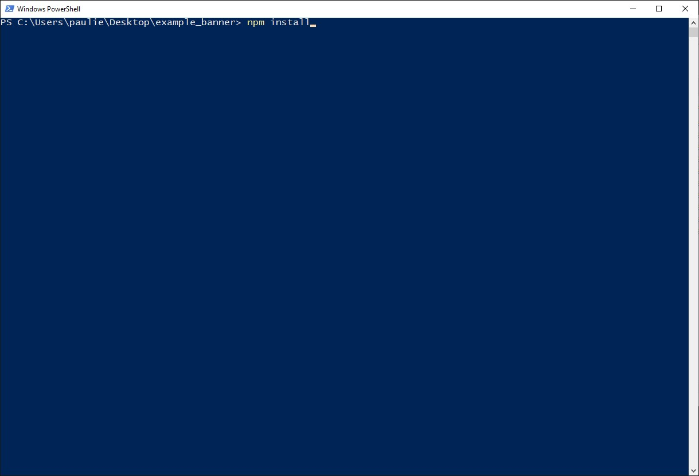

And press `Enter`

> **_NOTE:_** The installation can take a while, and you might see some warnings e.g "Found 9 vulnerabilities" etc 
> but that is something to not be worried about.**

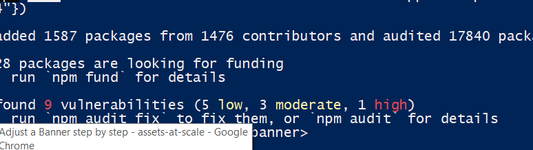

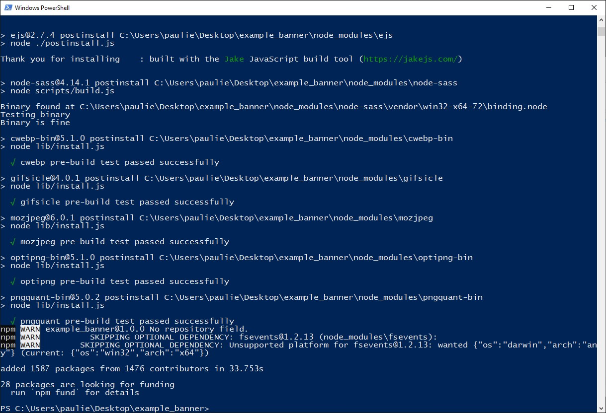

After installation your Command Line tool will look something like this. Besides this you can see that there has added a `node_modules` folder inside the unzipped folder.
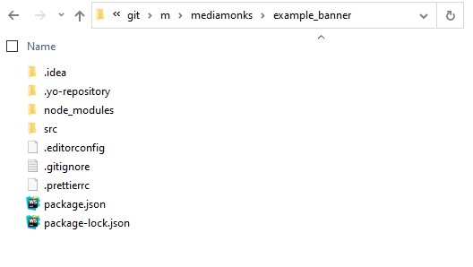

## Viewing banners

### Start running the dev environment

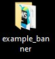

*Start your Command Line Tool from the project folder*

> **_NOTE:_** To keep in mind. Each time you want to view your banners or make amends to them. **In order to run the commands via the command line tool. You need to be in your project directory where the banners are**. For example `"C:\Users\User_name\Desktop\example_banner"`. This is the only way the framework can run the banners. You can't run the framework on a specific file or folder inside the project folder.

Open your Powershell from the unzipped folder again if you closed your Command line tool.

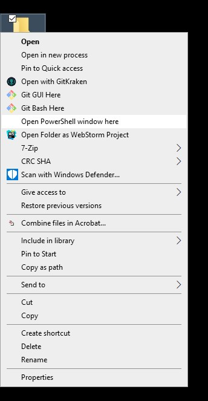

In order to view banners, after installing the packages, in your command line, **while running in the unzipped folder**, type:

$ `npm run dev`

It will search for config files which are the .richmediarc files in your files.

If there is more than one it will ask you which one you want to run. You can run them all, one or just a couple by selecting/deselecting the options by using the spacebar. Press enter to continue.

```  
? Please select config(s) build: (Press <space> to select, <a> to toggle all, <i> to invert selection)  
>( ) all  
 ( ) ./src/300x250_example_black/.richmediarc  
 ( ) ./src/300x250_example/.richmediarc  
 ( ) ./src/300x250/.richmediarc  
 ( ) ./src/300x600_example/.richmediarc  
 ( ) ./src/300x600/.richmediarc  
 ( ) ./src/728x90_example/.richmediarc  
(Move up and down to reveal more choices)  
```  
After you made a choice it will setup a local server and compile the banners via webpack. You will see something like this.
```  
> example_banner@1.0.0 dev C:\git\m\mediamonks\example_banner  
> node ./node_modules/@mediamonks/richmedia-temple-server/dev.js  
  
i Searching for configs  
✔ Found 1 config(s)  
  Choosing ./src/300x250/.richmediarc  
{  
  settings: {  
    entry: { js: './script/main.js', html: './index.html' },  
    size: { width: 300, height: 250 }  
  },  
  content: {}  
}  
Webpack: Starting ...  
i Server running. Please go to http://localhost:8000  
-------------------------------------------------------  
Webpack: Starting ...  
Webpack: Starting ...  
Webpack: Starting ...  
  
  √ Compile modules  
  √ Build modules  
  √ Optimize modules  
  √ Emit files  
  
Webpack: Finished after 3.275 seconds.  
  
webpack built caf6f58b0cf851c01cef in 3280ms  
i ｢wdm｣: Hash: caf6f58b0cf851c01cef  
Version: webpack 4.29.6  
Time: 3280ms  
Built at: 05/06/2020 15:22:45  
            Asset       Size  Chunks             Chunk Names  
        ./main.js    633 KiB    main  [emitted]  main  
       index.html  835 bytes          [emitted]  
 logo_2eDui55.jpg   4.93 KiB          [emitted]  
style_15Yy41B.css  833 bytes          [emitted]  
Entrypoint main = ./main.js  
[0] multi whatwg-fetch ./src/300x250/script/main.js 40 bytes {main} [built]  
[./node_modules/@mediamonks/temple/Entity.js] 5.95 KiB {main} [built]  
[./node_modules/@mediamonks/temple/component/ConfigComponent.js] 3.91 KiB {main} [built]  
[./node_modules/core-js/modules/es.array.iterator.js] 2.16 KiB {main} [built]  
[./node_modules/core-js/modules/es.object.get-own-property-descriptor.js] 778 bytes {main} [built]  
[./node_modules/core-js/modules/es.object.get-prototype-of.js] 666 bytes {main} [built]  
[./node_modules/core-js/modules/es.object.set-prototype-of.js] 281 bytes {main} [built]  
[./node_modules/core-js/modules/es.object.to-string.js] 387 bytes {main} [built]  
[./node_modules/core-js/modules/es.promise.js] 13.3 KiB {main} [built]  
[./node_modules/core-js/modules/es.reflect.construct.js] 2.14 KiB {main} [built]  
[./node_modules/core-js/modules/es.reflect.get.js] 1010 bytes {main} [built]  
[./node_modules/whatwg-fetch/fetch.js] 12.7 KiB {main} [built]  
[./src/300x250/.richmediarc] 135 bytes {main} [built]  
[./src/300x250/script/Banner.js] 7.97 KiB {main} [built]  
[./src/300x250/script/main.js] 117 bytes {main} [built]  
    + 124 hidden modules  
Child html-webpack-plugin for "index.html":  
                Asset       Size  Chunks             Chunk Names  
           index.html   28.9 KiB       0  
     logo_2eDui55.jpg   4.93 KiB          [emitted]  
    style_15Yy41B.css  833 bytes          [emitted]  
    Entrypoint undefined = index.html  
    [./node_modules/html-webpack-plugin/lib/loader.js!./src/300x250/index.html] 895 bytes {0} [built]  
    [./src/300x250/css/style.css] 63 bytes {0} [built]  
    [./src/300x250/img/logo.jpg] 62 bytes {0} [built]  
i ｢wdm｣: Compiled successfully.  
```  
After that, your browser will open a new tab, running on [http://localhost](http://localhost/) + an available port (such as 8000), displaying the banner(s) of your choice.

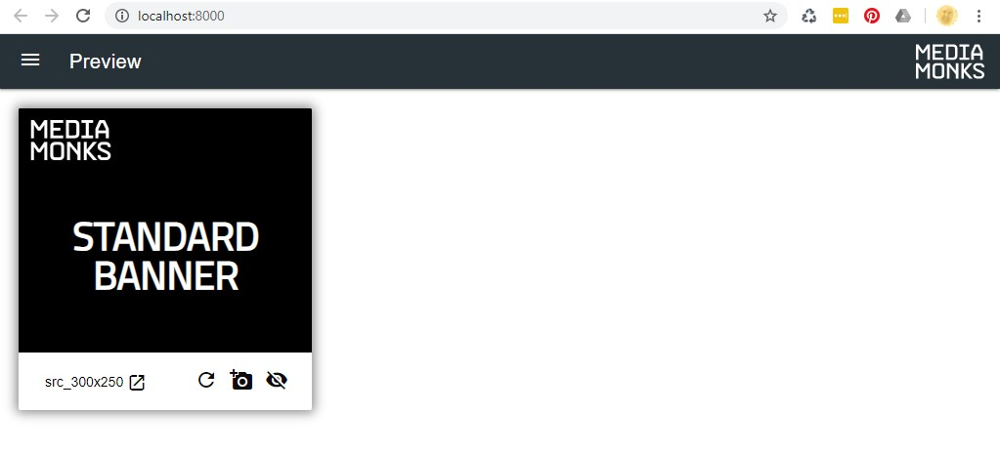

> **_NOTE:_** In computer networking, **localhost** is a hostname that means this computer. It is used to access the network services that are running on the host via the loopback network interface. Using the loopback interface bypasses any local network interface hardware.

When this **development environment**,  in short **"dev environment"** is running on the localhost you can change assets/code and when you refresh your browser it will automatically show the changes.

### Stop running the dev environment

To stop running the development environment type in your command line tool:

`Press Ctrl + C`

The Command Line tool will then ask "Terminate batch job (Y/N)?" Press Enter on your keyboard

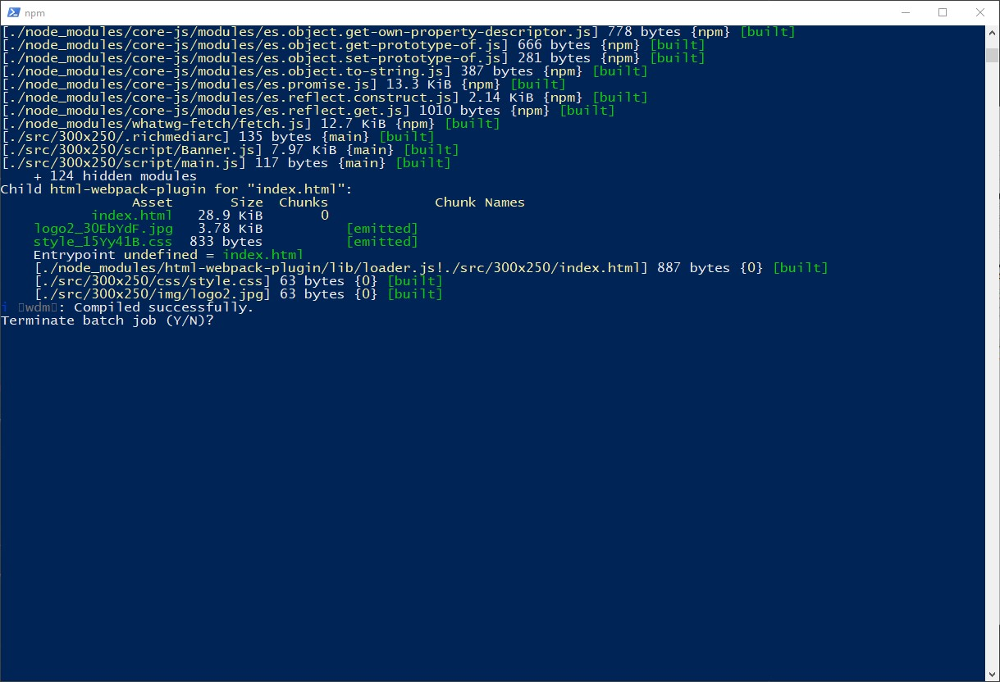

Type in **"y"** and press Enter:

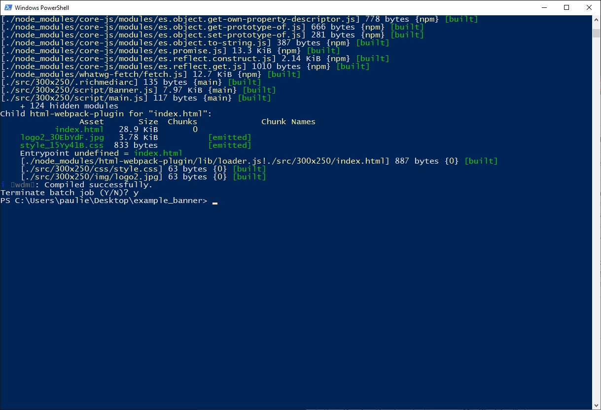

As you can see you will now head back to the path where you started, the unzipped folder path. And you are able to type in Commands again.

## Changing assets

When you are running in the dev environment. Webpack will automatically update the assets you change on refreshing the browser.

### Changing copy/images

If you want to change text or images you can easily do so by changing those in the index.html. Use a text editor like Notepad, VSCode, Webstorm .etc to make changes or your own favorite editor.

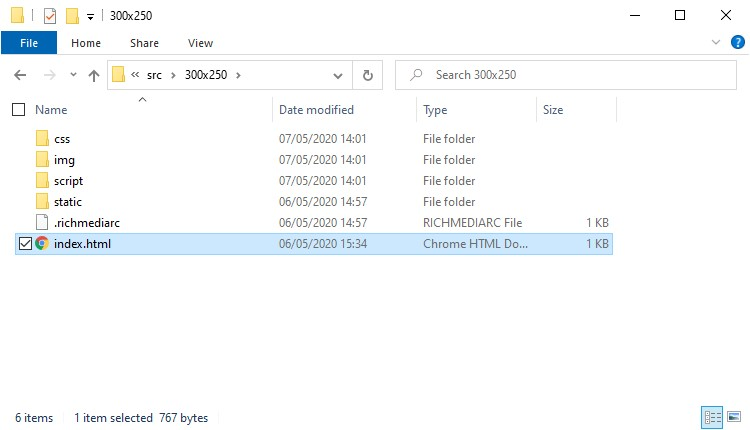

Open the index.html file inside the 300x250 folder with your text editor. If you want to open it with Notepad for example. Right-click on the index.html > in the menu > choose "Open with" > and choose Notepad from the options there.

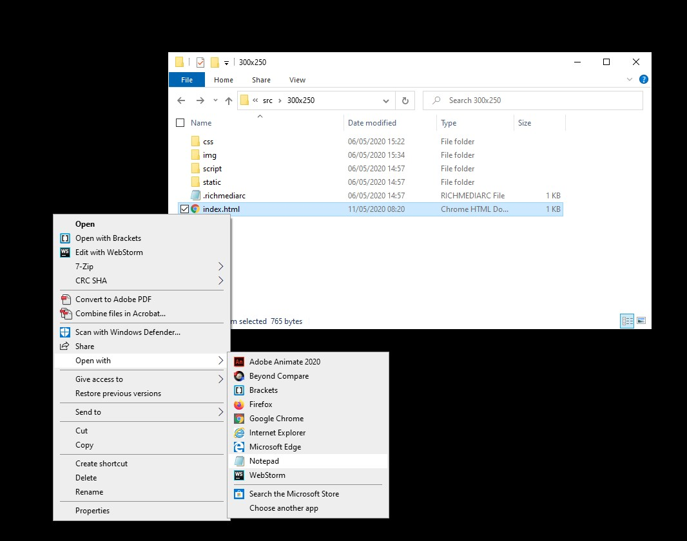

In your index.html you will something that looks like this:

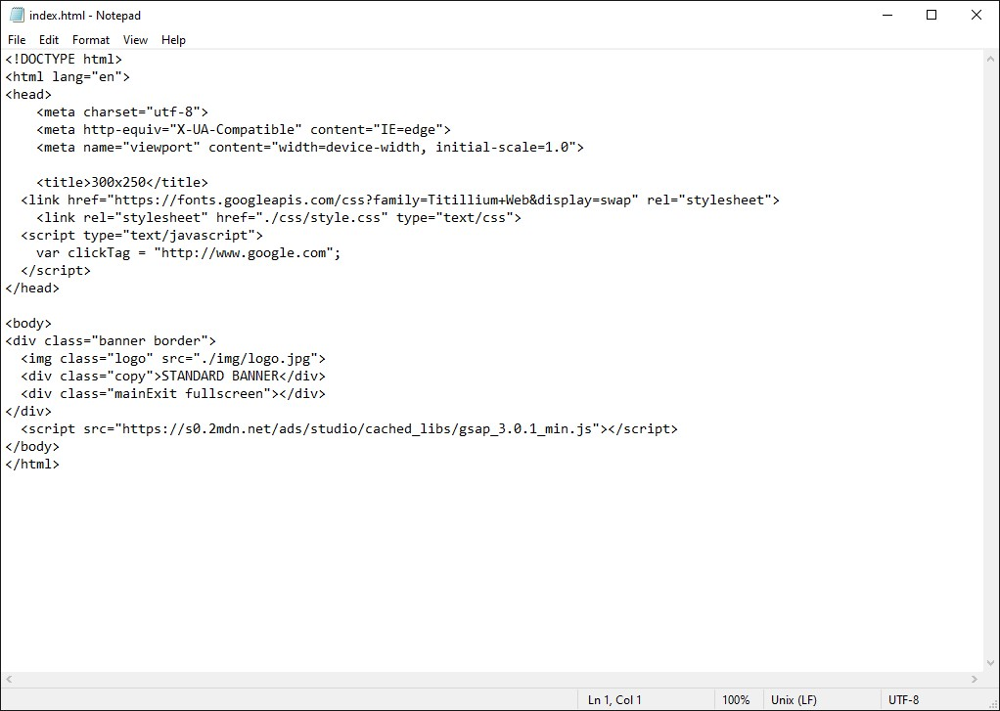

If I amend the copy and the image from this:
```html  
<div class="banner border">  
    
  <div class="copy">STANDARD BANNER</div>  
  <div class="mainExit fullscreen"></div>  
</div>  
 ```  
To this:

```html  
<div class="banner border">  
    
  <div class="copy">RICHMEDIA BANNER</div>  
  <div class="mainExit fullscreen"></div>  
</div>  
 ```When I refresh the page I see the changes:  
  
<div style="display: flex; justify-content: center; width: 300px;">
  
</div>
```  
  
### Changing styles  
  
In the css folder there is a style.css file you can make amends to for example, the color of text. Or the position of an image.  
  
### Changing javascript (code)  
  
#### Shared code  
  
In the `lib/shared` folder we put all the shared code that has been shared throughout all the sizes in the project.  
  
#### Code specific for one size  
  
In the script folder, we put all of our custom code that is dependant upon to the size.  
  
## Build the banners  
  
After the changes have been done we can now build the banner so that we get a new compiled package.  
  
$ `npm run build`  
  
If you have more than one size, it will ask you which files need to be build. Then it will ask you where to build the project.  
  
> **_Note:_** The building of this project is done with webpack. Webpack will reduce the size of js code, images, svg files etc. And will also as specified combine a lot of js files into one.

```  
✔ One config found ./src/300x250/.richmediarc  
? Please choose build location (./build)
```  
_You can choose the default option by just pressing Enter, the build directory _ 
  
```  
? Please choose build location ./build  
Webpack: Starting ...

✔ Compile modules  
✔ Build modules  
✔ Optimize modules  
✔ Emit files

Webpack: Finished after 3.962 seconds.
```  
> **_Note:_** Project has been build. Now take a look in the build directory.  


| Filename    | Description |
| ----------- | ----------- |
| bundle.zip      | all the files below in one zip. |
| index.html   | html file. |
| main.js   | main javascript file. |
| style_v7h2ieE.css   | css file, those weird chars in the file name is the hash of the file it self. |

## Creating a new size

If you want to create a new size you can simple copy the folder of the size that's most near in terms of animation and width/height relations. For example, I have a 300x250 and I am going to create an 300x600 out of it.

Copy paste the folder of the size you want to duplicate to a new size

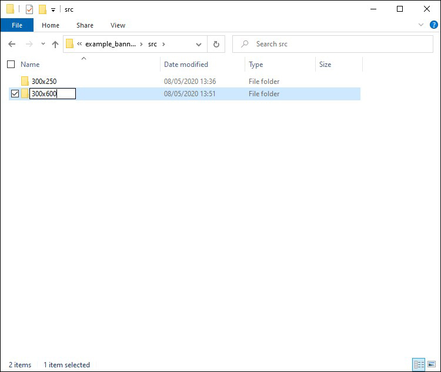

### Changing the width and height

First start with changing the size of the banner.

> **_Important:_** The **.richmediarc** is a configuration file that includes the path to the first loaded javascript file, the main html file and the width and height of the banner. It is mandatory in each size so that it can be found when you build a banner.

In the folder of the created size, look for the .richmediarc file and open it in your editor.

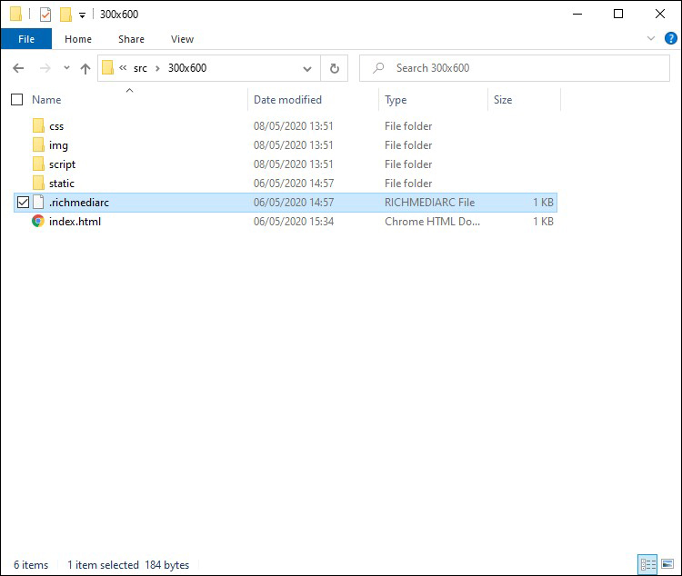

Change the height from 250 to 600 and save the file.

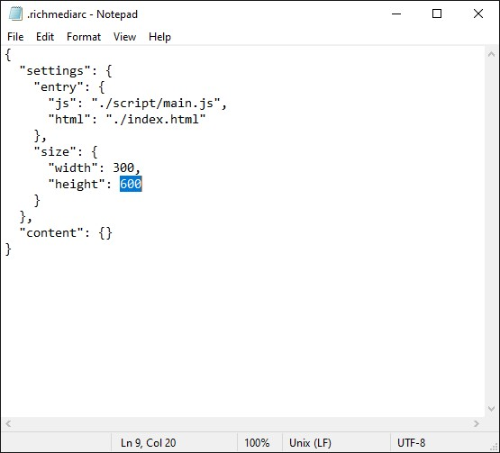

In the .css file, which you can find in the folder css, change the height to 600px and save the file.

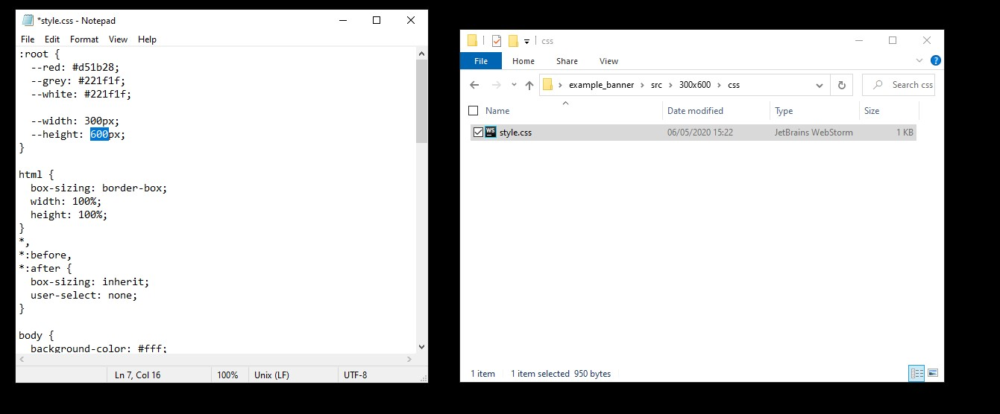

If you now type "npm run dev" while in the folder of your project, you will see a new option of displaying the 300x600. By pressing `Spacebar` you select the "all" option to preview all banners in the dev environment. And press Enter to build the dev environment.

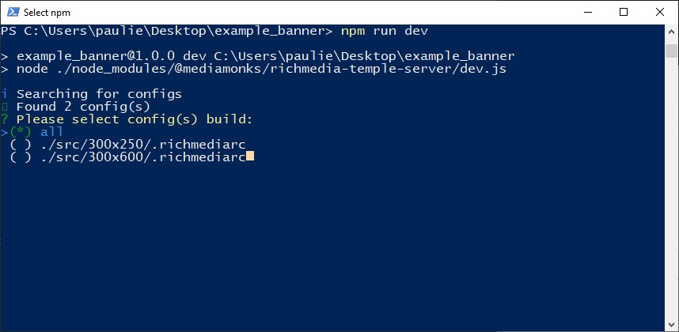

Your browser will open up a new tab an preview a second banner with the size of 300x600.

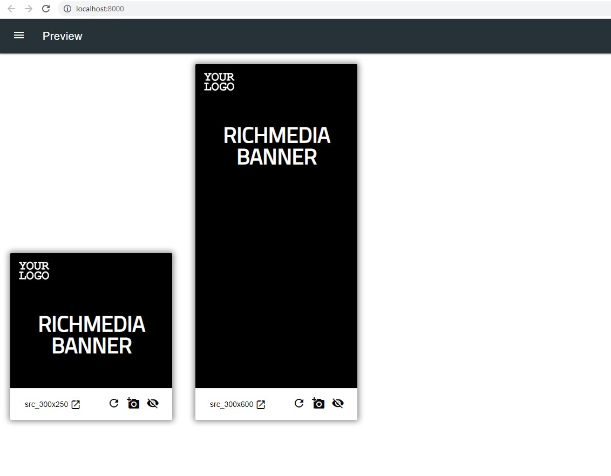

### Creating a new build

In order to make a correct export to put it online. We are going to make a "build" version out of it. Close the running dev environment by pressing **"ctrl + C"** in your command line tool. Type **"Y"**, and press `Enter`.

Press: `ctrl + C`  

Type:  `Y` and hit `Enter`

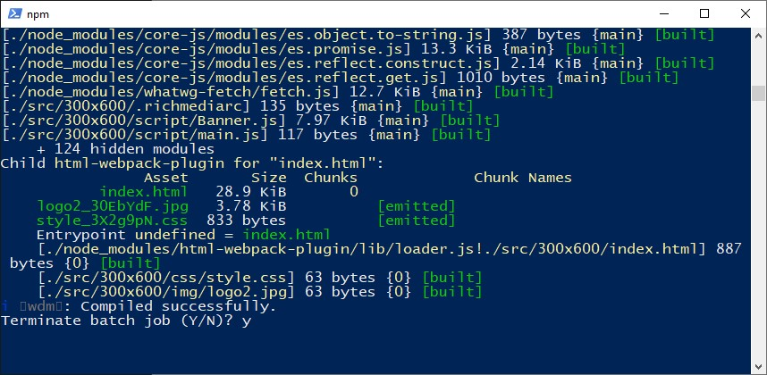

Now type in your command line tool:

$ `npm run build`

If the "build" folder is not empty it will ask if it needs to delete the files that are in. Press **Y** for yes and **N** for no. It's okay to delete them. But if you have a lot of banners, and you don't want to build them all over and over again since it takes time it is better to say **N** (no).

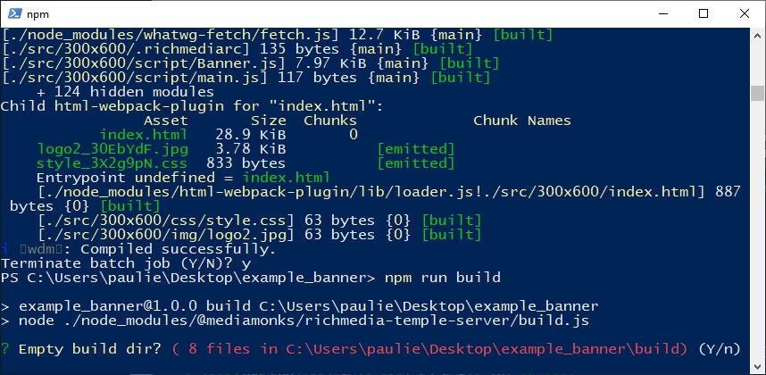

Choose the banners to build, which are the 300x250 and 300x600. Select with `Spacebar` and press `Enter`.

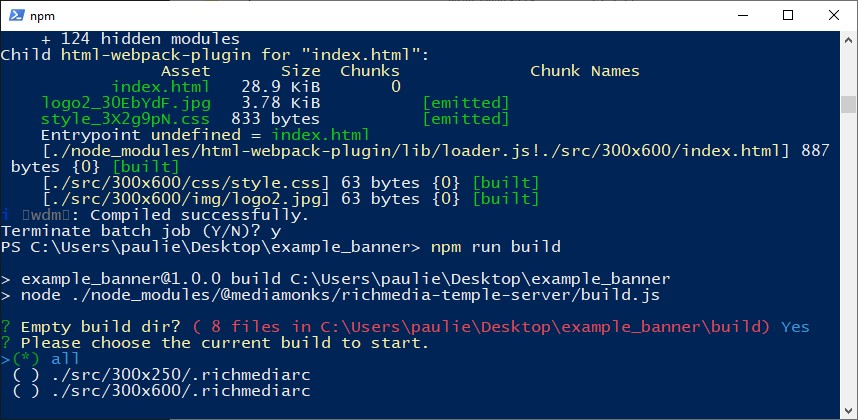

You will see that it runs a script here

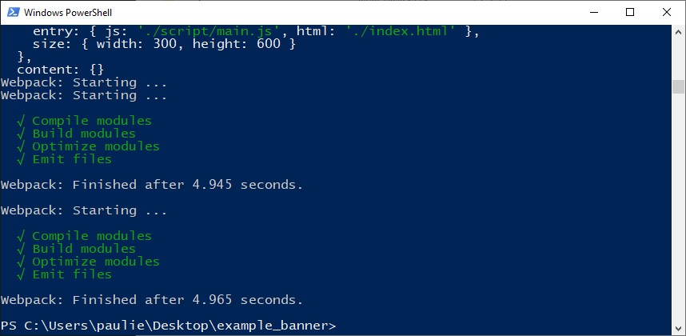

Now if you check your build file in the folder

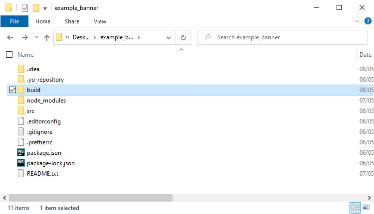

You will see a second folder with the 300x600 in it.

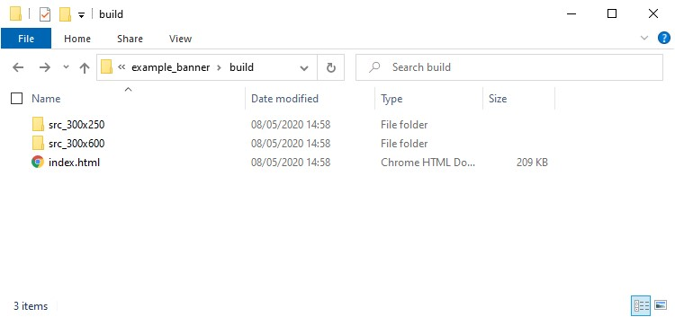

<div class="container">
    <div class="link__item">
        <a href="./package-json.html"><i
        class="fas fa-long-arrow-alt-left"></i> Package json</a>
    </div>
		<div class="link__item">
        <a href="./richmediarc.html">.ricmediarc <i
        class="fas fa-long-arrow-alt-right"></i></a>
    </div>
</div>
