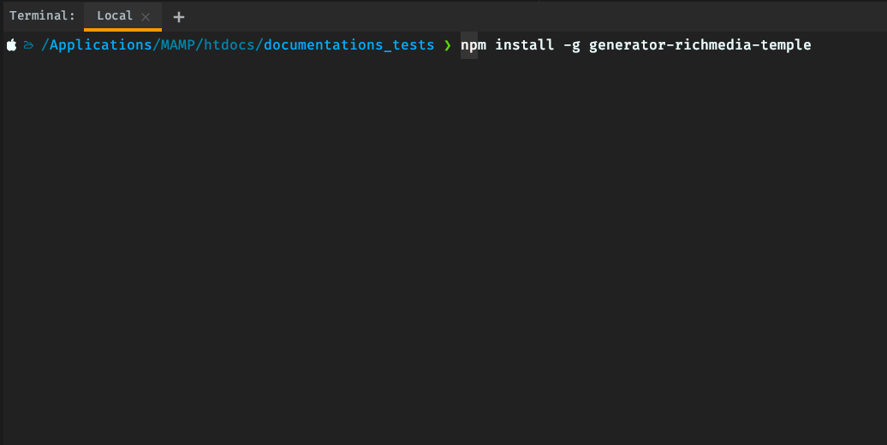

## Initial setup
### _**Software required**_

-   Terminal i.e Windows Powershell, iTerm (Mac OS) etc

-   Code editor, i.e. <a href="https://code.visualstudio.com/" target="_blank">VSCode</a>,
    <a href="https://www.jetbrains.com/webstorm/" target="_blank">Webstorm</a> etc

-   <a href="https://nodejs.org/en/" target="_blank">NodeJS</a> V12 or higher

The richmedia generators is built with the help of [Yeoman](https://yeoman.io/) which is web scaffolding tool for 
modern web tools. The first thing that we will need to do is install yeoman globally, so it's available in your 
terminal / command prompt as `yo`

### Step 1

**Open your terminal run the following commands:**

First install Yeoman globally

$ `npm install -g yo`

### Step 2

Install the Media Monks richmedia generator globally

$ `npm install -g generator-richmedia-temple`

Verify Yeoman is working globally by running the following command

$ `yo --version`

_If it shows you the version number, you are ready continue to the next step **Creating a new project**._

    

        <a href="https://mediamonks.github.io/display-advertising-docs/" class="pageNav__item">
          <i class="fas fa-arrow-left" style="font-size: 2.5rem;"></i>
        </a>
        

          <h3 style="font-size: 1.2rem">Prev: Home Page</h3>
        

    

    

        <a href="https://mediamonks.github.io/display-advertising-docs/getting-started/" class="pageNav__item">
          <i class="fas fa-arrow-right" style="font-size: 2.5rem;"></i>
        </a>
        

          <h3 style="font-size: 1.2rem">Next: Creating a new project</h3>
        

    

